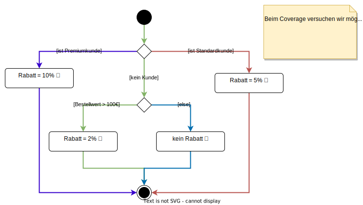

# Allgemeines

- Aktueller Lehrplan ist Version 4.0.1. Dieser wurde im Jahr 2023 veröffentlicht.
- Ab Juni 2024 können Prüfungen nur noch nach dem neuen Lehrplan abgelegt werden.
- Bis einschließlich Mai 2024 sind noch Prüfungen mit Lehrplan 3.1 möglich.
- ca. 70% des Lehrplans sind zwischen v.3.1 und v4.0 identisch geblieben.
- Die Prüfung dauert 60 Minuten, wobei 40 Multiple-Choice-Fragen  zu beantworten sind. 
  - Um die Prüfung zu bestehen, müssen 65% der Gesamtpunktzahl erreicht werden, also 26 Punkte.
  - Für jede Frage gibt es genau einen Punkt.
  - Bei manchen Fragen braucht man deutlich mehr Zeit, um sie zu beantworten, als bei anderen. Trotzdem ist die Punktzahl stets 1.
- **Hinweis:** Wenn man die Prüfung in einer Sprache abhält, die nicht die eigene Muttersprache ist, kann man eine Verlängerung der Prüfungszeit um 25% beantragen. Das sind bei 60 Minuten Prüfungszeit 15 Minuten zusätzlich.

# Lehrplan

- Der Lehrplan ist in 6 Kapitel unterteilt.
- Die Kapitel 4 und 5 sind am wichtigsten, da sich ca. 50% der Prüfungsfragen auf diese beiden Kapitel beziehen.

# Weiterbildungsmöglichkeiten

Die Foundation Level Zertifizierung ist die Basis für alle weiteren Zertifizierung des ISTQB. Es gibt folgende Ausbildungsstufen:

- Foundation Level
- Advanced Level
- Expert Level

Zusätzlich sind Module für Spezialisierungen wie Game Testing und Usability Testing möglich. Außerdem sind auch im Bereich Agile Softwaretesting separate Zertifizierungen durchführbar.

# Unterschied zwischen Efficiency and Effectiveness

- Efficiency: Ein gutes Verhältnis zwischen Nutzen eines Tests und die dafür benötigten Ressourcen wie Zeit, Personal, Budget etc.
- Effectiveness: Damit meint man die Wirksamkeit eines Tests. Ein Test ist wirksam, wenn er genau testet, was gewünscht ist und akkurate sowie vollständige Ergebnisse liefert.

# Chapter 1

## Was ist Testing?

- Eine Software zu testen bedeutet nicht nur, die Software auszuführen und auf Fehler zur prüfen, sondern auch die Dokumentation zu bewerten, den Quelltext zu lesen und nach logischen Fehlern zu suchen.
- Unterschied Verifizierung und Validierung:
  - Beim Verifizieren wird geprüft, ob die Software ihre Spezifikation bzw. die Anforderungsliste korrekt umsetzt.
  - Bei der Validierung wird geprüft, ob die Software das tut, was ihre Endanwender von ihr erwarten.
  - Mit anderen Worten: Wenn eine Software laut Spezifikation korrekt implementiert wurde (Verifikation), aber nicht das tut, was der Kunde sich gewünscht hat (Validierung), dann hat die Software keinen wirklichen Nutzen und somit ihr Ziel verfehlt.
- dynamisches Testen: Die Software befindet sich in der Ausführung, während getestet wird.
- statisches Testen: Die Software wird ohne Ausführung getestet, z.B. durch gemeinsame Reviews des Source Codes. Es wird vor allem nach logischen Programmierfehlern im Quelltext gesucht. Beispiel: Im Quelltext wird eine Division ausgeführt, aber der Quelltext prüft nicht, ob der Teiler Null ist (Fault, Defect). Wenn nun versucht wird, durch Null zu teilen, stürzt das Programm ab (Failure/Ausfall/Fehlfunktion).

### Ziele von Software-Testing

- Bewertung von Arbeitsergebnissen, wie Anforderungsdokumente, User Stories, Entwürfe (UI und Softwarearchitektur), Quelltext etc.
- Beispiel User Story: As a manager (Rolle), I want to be able to understand my colleagues progress (Was soll das System leisten?), so I can better report our sucess and failures (Intent, Begründung für Anforderung).
- Mängel (Defects) in der Software finden: z.B. logischer Programmierfehler im Quelltext (`ArrayIndexOutOfBounds`, `DivisionByZero`, Endlosschleifen etc.).
- Fehlverhalten (Failures) in der Software auslösen: z.B. Eingabe eines Wortes statt einer Zahl führt zum Absturz eines Programms (`Exception`) oder zu einem falschen Ergebnis (z.B. `NaN` in JavaScript).
- Möglichst alle Pfade durch das Programm testen (Test Coverage), sofern technisch durchführbar.

Beispiel für ein Test Coverage eines Algorithmus zur Berechnung von Kundenrabatten:

### Unterschied zwischen Testing und Debugging

Ein Debugger ist ein Programm, mit dem der Softwareentwickler ein Programm schrittweise ausführen und analysieren kann (Variableninhalte anzeigen, Speicherverbrauch etc.). Ein Debugger wird dazu verwendet, logische Programmierfehler aufzuspüren, also Defects zu finden. Durch einen Debugger ist es i.d.R. erheblich einfacher, die Ursache für ein Fehlverhalten eines Programms zu ermitteln. **Debugging wird nicht als Testing angesehen, sondern ist für die Ermittlung der Fehlerursachen erforderlich**.

Testing ist umfassender als Debugging. Beim Testen kann auch eine statische Analyse vorgenommen werden, also eine Analyse ohne Ausführung des Programms. Beim Debugging ist die Ausführung immer erforderlich. Debugging ist lediglich ein Teilaspekt des Testens und wird in den meisten Fällen nicht direkt vom Tester, sondern vom Entwickler durchgeführt.

Wenn der Entwickler den gefundenen Defect behoben hat ("Das müsste jetzt funktionieren!"), also den Quelltext entsprechend modifiziert hat, dann muss der Tester den Testfall erneut durchführen und prüfen, ob der Fehler tatsächlich behoben ist.

### Was ist Regression Testing?

Wenn man Quelltext modifiziert bzw. erweitert, kann es passieren, dass man unbeabsichtigt neue Defects in das Programm einbaut. Das kann auch an Stellen im Source Code auftreten, an denen man gar nichts geändert hat, aber die aufgrund von Querabhängigkeiten von der Veränderung indirekt betroffen sind. Regression Testing prüft, ob nach einer Modifikation das Programm noch ordnungsgemäß funktioniert, also "nichts kaputt gemacht wurde". Eine Regression ist ein solcher "neu eingebauter" Defect.

Beispiel: Eine kleine Funktion `boolean isAdult(int age)` zur Bestimmung der Volljährigkeit wird derart modifiziert, dass erst ab einem Alter von 21 eine Volljährigkeit besteht. Da diese Funktion in vielen anderen Teilen bzw. Komponenten der Software verwendet wird, kann dies zu unerwarteten Fehlern bzw. fehlerhaften Ergebnissen im Programm führen. Ein Regression Testing prüft hier, ob die anderen "Teile" bzw. "Komponenten" noch ordnungsgemäß funktionieren, also keine Regression stattfindet.

## Warum ist Testing notwendig?

### Unterschied Quality Control und Testing

Qualitätskontrolle (Quality Control) schließt alle Maßnahmen und Tätigkeiten ein, mit denen **die Qualität eines Systems bzw. Produkts** geprüft und sichergestellt werden kann. **Testing hingegen ist nur _eine_ Form der QA**: eine Tätigkeit, die während des Softwarelebenszyklus durchgeführt wird, um die Qualität der Software sicherzustellen. Neben dem Testing gibt es noch andere Formen von QC: Simulationen, Prototyping (eine unvollständige Software, die nur einen bestimmten Aspekt des Systems implementiert, z.B. UI Mockups), Eigenschaften prüfen an einem Modell (z.B. aus einem Material wie Plastik, Holz etc.), mathematische Korrektheitsbeweise etc.

Im Gegensatz zur Qualitätskontrolle (QC) **bezieht sich Quality Assurance (Qualitätssicherung) auf den gesamten _Entwicklungs- und Testprozess_**. Beim QA geht es darum, den Entwicklungsprozess derart zu optimieren, dass unter dessen strikter Einhaltung qualitativ hochwertige (Software-) Produkte entstehen. Jeder, der am Softwareprojekt beteiligt ist, ist auch indirekt am QA beteiligt.

Testberichte dienen als Feedback für die Qualitätskontrolle sowie das QA. Beim QC werden Testberichte verwendet, um Defects zu beheben. Beim QA werden die Testergebnisse verwendet, um den Entwicklungs- und Testprozess zu optimieren bzw. anzupassen.

### Errors, Defects, Failures, Root Cause

Wenn ein Nutzer eine Software verwendet und etwas "falsch macht", dann bezeichnet man das als Error. Beispiel: Der Nutzer soll in ein Eingabefeld eine Zahl eingeben, aber tippt versehentlich einen Text ein. Die Errors eines Nutzers können die Defects einer Software auslösen (triggern). Wenn ein solcher Defect ausgelöst wird, dann führt das in der Regel zu einem Fehlverhalten / Fehlfunktion der Software (Failure). Beispiel: Ein Programm fordert den Nutzer auf, eine Zahl einzugeben, der Nutzer gibt aber versehentlich einen Text ein. Da das Programm die Benutzereingaben nicht validiert (Defect), stürzt das Programm bei einer Berechnung ab (Failure).

Defects treten hauptsächlich in folgenden Dokumenten auf:

- Source Code
- Anforderungsdokumente (z.B. Pflichtenheft)
- Softwaredokumentation (z.B. Instruction Manual)
- Build-Dateien (Skripte, die die Software übersetzen, in ein Paket verpacken und ggf. ausführen)

Hinweis: Manche Defects treten gar nicht, sehr selten oder nur in ganz bestimmten Situationen auf. Je eher man einen Defect erkennt, umso besser. Software Testing sollte über alle Entwicklungsphasen hinweg durchgeführt werden, also beginnend ab der Analysephase.

Wenn das System einen Failure hat, kann das auch bedeuten, dass die Software etwas tut, was sie gar nicht machen soll. Beispiel: Eine fehlerhafte Produktionsmaschine baut nicht-funktionierende Platinen.

Manche Failures werden nicht durch den Nutzer ausgelöst, sondern durch Ereignisse, die in der IT Infrastruktur aufreten: z.B. der Ausfall eines Datenbankservers kann dazu führen, dass eine Software nicht ordnungsgemäß funktioniert, weil die Software für ihre Aufgabe die Daten aus der Datenbank benötigt. Auch physikalische Beeinträchtigungen wie kosmische Strahlung (z.B. im Weltall) oder elektromagnetische Felder (z.B. bei Funktürmen) können die Funktionsweise eines Hard- und Softwaresystems derart einschränken, dass das System seine Aufgabe nicht mehr erfüllen kann.

Die Root Cause (Hauptursache) ist die eigentliche Ursache für das Auftreten eines Fehlers. Manche Fehler sind lediglich "Symptome" der Root Cause. Solange man nicht die Root Cause findet und behebt, werden immer wieder Fehler auftreten. Beispiel: Eine Software muss umfangreiche Daten in Echtzeit in ein Datenbanksystem abspeichern. Es kommt hin und wieder vor, dass das Datenbanksystem überlastet ist und Anfragen nicht bearbeiten kann, wodurch Fehler entstehen. Eine kurzfristige Lösung wäre, wenn die Software die Datenbankanfragen künstlich verzögert, so dass keine Überlastung auftreten kann. Die eigentliche Hauptursache für das Problem ist jedoch die mangelnde Leistung des Datenbanksystems. Dieses müsste ausgetauscht oder repliziert werden, so dass Anfragen auf mehrere Server verteilt und schneller bearbeitet werden können.

## Testing Principles

1. Testing kann nur die Anwesenheit von Defects nachweisen, nicht jedoch deren Abwesenheit bzw. die Fehlerfreiheit bzw. vollständige Korrektheit der Software! Testing reduziert lediglich die Wahrscheinlichkeit, dass Defects unentdeckt bleiben.
2. Vollumfängliches Testen ist praktisch unmöglich: Ein Programm mit allen möglichen Eingaben zu testen und alle Programmpfade zu durchlaufen, ist in der Praxis nicht möglich und auch nicht sinnvoll. Stattdessen sollte man versuchen seine Tests zu priorisieren und nach Risiko zu gewichten. Jene Komponenten, deren Fehlverhalten zu massiven Auswirkungen führen könnten, sollte man im Idealfall als erstes testen.
3. Frühes Testen spart Zeit und Geld. Beispiel: Du entwickelst eine Softwarebibliothek für deine Kollegen im Unternehmen. Deine Kollegen verwenden diese Bibliothek für ihre Programme. Falls deine Bibliothek gravierende Defects enthält, wird das natürlich auch Auswirkungen auf die Software deiner Kollegen haben. Hier wäre es von großem Vorteil, wenn du die Bibliothek vor der Weitergabe ausführlich testest und auf Korrektheit prüfst.
4. Defects haben "Hot Spots": Es wurde beobachtet, dass sich die meisten Defects innerhalb einiger weniger Systemkomponenten konzentrieren (sogenannte Hot Spots). Diese Defects führen hauptsächlich zum Fehlverhalten der Software. Achtung: Je mehr Tests man durchführt, umso mehr Defects wird man sehr wahrscheinlich auch finden.
5. Tests verlieren eventuell an Wirksamkeit: Bestehende Tests sorgen in der Regel nicht dafür, neue Defects zu entdecken. Wenn man also eine Software erweitert, muss man zwangsläufig auch neue Tests entwickeln. Bestehende Tests können jedoch für das Regression Testing hilfreich sein. 
6. Testing ist abhängig vom Kontext: Testverfahren bzw. Testmethoden unterscheiden sich je nach Softwareprojekt bzw. auch nach Umfang der Software und den zeitlichen, finanziellen und gesetzlichen Rahmenbedingungen. Beispiel: Eine Software mit grafischer Schnittstelle wird anders getestet, als eine Software, die lediglich kommandozeilenbasiert arbeitet. Eine Software, die im medizinischen Bereich eingesetzt wird und deren Fehlverhalten zum Tode eines Menschen führen kann, wird deutlich strikter geprüft, als ein PC-Spiel.
7. Abwesenheit von Fehlern bedeutet nicht zwangsläufig, dass die Software korrekt bzw. zielgerichtet entwickelt wurde: Nur weil die Software die Spezifikation vermeintlich fehlerfrei erfüllt, heißt das nicht, dass die Software auch dem Endkunden den gewünschten Nutzen bringt und ihn bei seiner alltäglichen Arbeit unterstützt. Neben der Verifikation ist auch immer eine Validierung notwendig.

